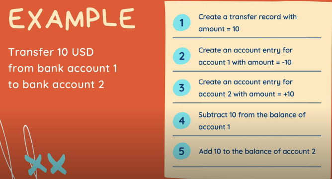
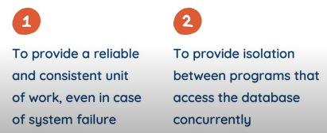
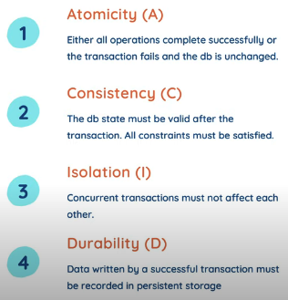

# A clean way to implement database transaction in Golang

Combin multiple operations from several tables




```
	BEGIN;

	COMMIT;

	ROLLBACK;
```

## store.go
store struct provide all functions to run database queries individually as well as their combination in a trasaction.

Fo the individual queries, we have query struct generated by sqlc
```
	type Queries struct {
		db DBTX
	}
```
Each query only do 1 operation on 1 specific table. like
```
	func (q *Queries) CreateAccount(...) {

	}
```
To support transaction, we `extend` the Queries struct
```
	// Store defines all functions to execute db queries and transactions
	// this interface can be used to mock db
	type Store interface {
		Querier
		TransferTx(ctx context.Context, arg TransferTxParams) (TransferTxResult, error)
	}

	// SQLStore provides all functions to execute SQL queries and transactions
	type SQLStore struct {
		db *sql.DB // required to create a new db transaction
		*Queries
	}
```


Exec transaction
isolation level: read-committed is used in Postgres
```
func (store *SQLStore) execTx(ctx context.Context, fn func(*Queries) error) error {	
	
	// return a transaction
	tx, err := store.db.BeginTx(ctx, nil)
	if err != nil {
		return err
	} 
 
	// get queries
	q := New(tx)
	// call the
	err = fn(q)
	if err != nil {
		if rbErr := tx.Rollback(); rbErr != nil {
			return fmt.Errorf("tx err: %v, rb err: %v", err, rbErr)
		}
		return err
	}

	return tx.Commit()
}
```


## UT
