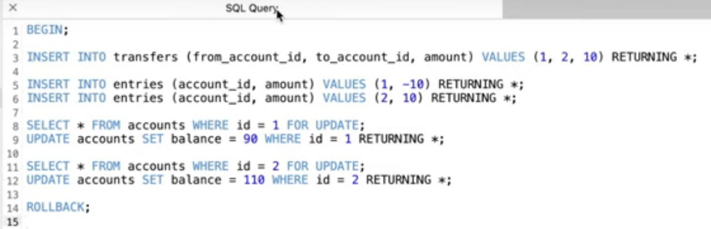
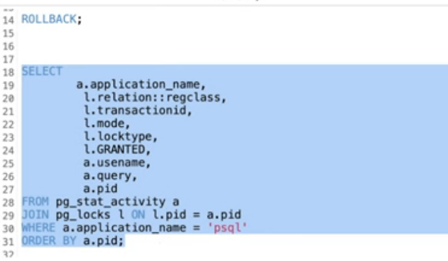

# DB transaction lock & How to handle deadlock in Golang
https://www.youtube.com/watch?v=G2aggv_3Bbg&list=PLy_6D98if3ULEtXtNSY_2qN21VCKgoQAE&index=7&ab_channel=TECHSCHOOL

concurrent transaction 时出现错误的代码
```
  // it doess't block other transaction from reading the same account
  // two concurrent transactions can get the same value of account 1
  account1 = GetAccount(ID1)         
  update(account1)

  account2 = GetAccount(ID2)
  update(account2)
```  

## 为了fix 这个错误，考虑block后来的transaction:
Demo: start psql console in two differnet teminal tabs and run two parallel transactions
```
  docker exec -it postgrees12 psql -U root -d simple_bank

  BEGIN;
  SELECT * FROM accunts WHERE id = 1 FOR UPDATE;

```
in second tab, the transaction was blocked to wait for the first transaction to COMMIT or ROLLBACK
```
  docker exec -it postgrees12 psql -U root -d simple_bank

  BEGIN;
  SELECT * FROM accunts WHERE id = 1 FOR UPDATE;

```

Create method `GetAccountForUpdate`
```
-- name: GetAccountForUpdate :one
SELECT * FROM accounts
WHERE id = $1 LIMIT 1
FOR UPDATE;

```

代码改为
```
  account1 = GetAccountForUpdate(ID1)         
  update(account1)

  account2 = GetAccountForUpdate(ID2)
  update(account2)
```  
此时出现 deadlock

## Debug Deadlock
给transaction 加上name
```
  ctx := context.withValue(context.Background(), txkey, txName)

  result, err := store.TransferTx(ctx, transferParams)

```
 Print name
```
  txName := ctx.Value(txKey)
```


分别开两个console，分别执行以上代码，可以重现deadlock

## Check Deadlock 
https://wiki.postgresql.org/wiki/Lock_Monitoring

```
  SELECT a.datname,
          l.relation::regclass,
          l.transactionid,
          l.mode,
          l.GRANTED,
          a.usename,
          a.query,
          a.query_start,
          age(now(), a.query_start) AS "age",
          a.pid
  FROM pg_stat_activity a
  JOIN pg_locks l ON l.pid = a.pid
  ORDER BY a.query_start;
```
可以看到deadlock发生的原因

SELECT * FROM account is blocked

INSERT INTO transfe() is blocking


The `from_account_id` and `to_account_id` of transfers table are refering the `id` column of accounts table. So any update on account id will affet this foreign key constraint. 

Because Postgrees worries that transaction 1 will update the accoun id, which would affet the foreign key constraints of transfers table.

So the solution is to tell Postgres the primary key(id column) won't be touched.
```
  SELECT FOR NO KEY UPDATE
```