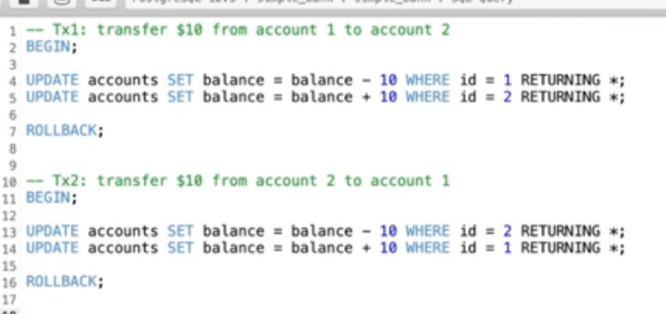

# How to avoid deadlock in DB transaction? Queries order matters!

https://www.youtube.com/watch?v=qn3-5wdOfoA&list=PLy_6D98if3ULEtXtNSY_2qN21VCKgoQAE&index=8&ab_channel=TECHSCHOOL


```
  q.AddAccountBalance(account1)

  q.AddAccountBalance(account1)
```
如果两个 transaction 同时更新 同一对 account，比如account1 -> account2, account2->account1, 可能会导致deadlock



Solution:
总是先操作id小的account
