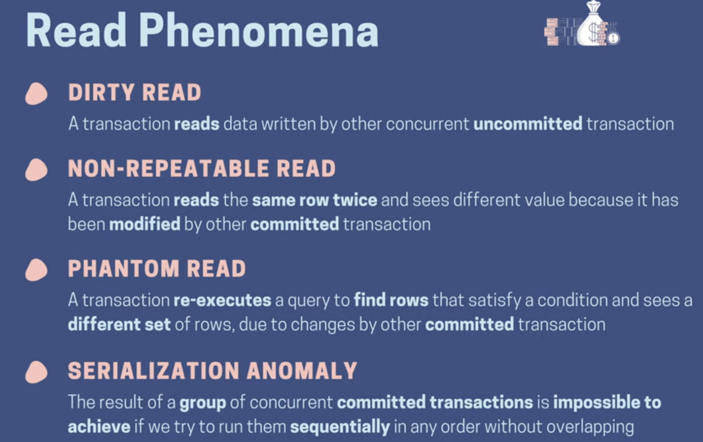
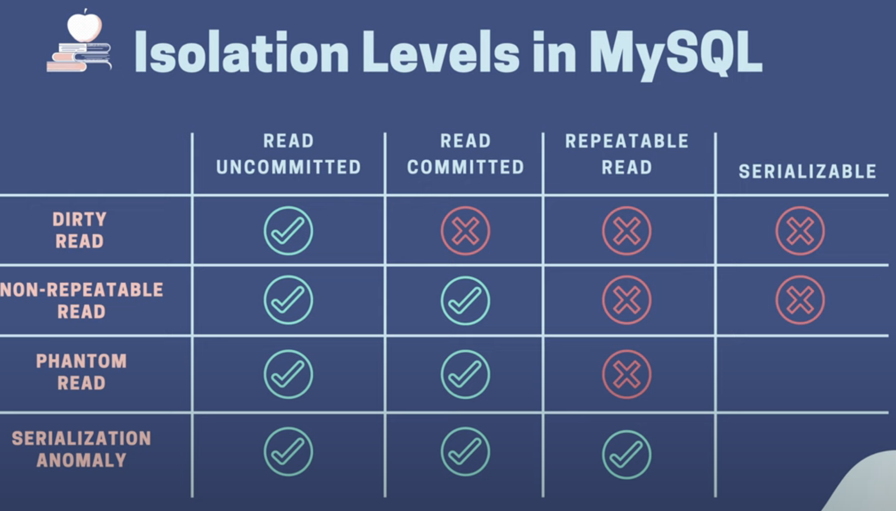

# Understand isolation levels & read phenomena in MySQL & PostgreSQL via examples
https://www.youtube.com/watch?v=4EajrPgJAk0&list=PLy_6D98if3ULEtXtNSY_2qN21VCKgoQAE&index=9&ab_channel=TECHSCHOOL

Each db engine choose to implement in different way

phenomena

