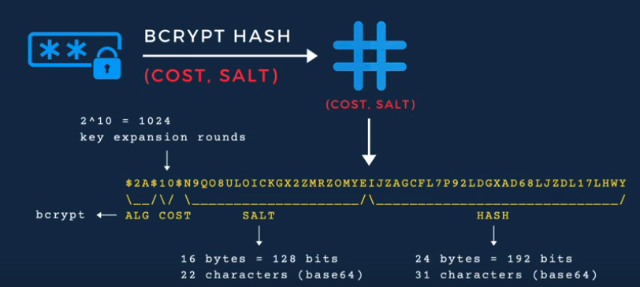
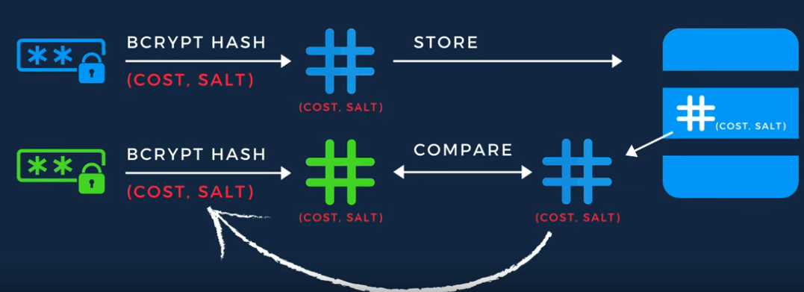

# How to securely store passwords? Hash password in Go with Bcrypt!




``
$2a$10$jl21YoICPqUPelT55x/v4eqhhZhYBo3Vf..AdtxPRHVZd/whJnC8C
```

In the bcrypt.GenerateFromPassword(), a rundom salt was used. 